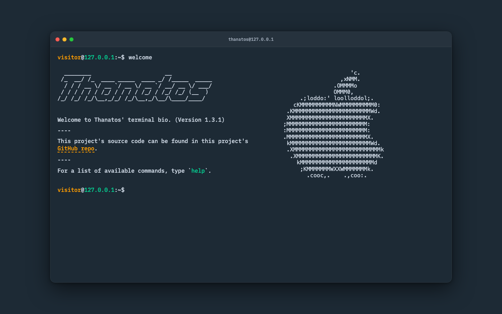

# terminal-bio

`terminal-bio` 是一个可自由定制的交互式终端个人主页模板。页面使用 React、TypeScript 和 styled-components 构建，在主题同色背景上呈现一个 macOS 风格的悬浮终端窗口。访客可以输入命令查看介绍、项目、社交地址、命令历史和主题列表。



## 页面效果

- 桌面端使用居中的 macOS 风格终端窗口，包含标题栏、红黄绿窗口标识、圆角、边框和阴影。
- 移动端自动切换为全屏终端，并适配移动设备安全区。
- 首页支持自定义 FIGlet 字符横幅和 ASCII 图。
- 页面背景、终端窗口、文字和滚动条会随当前主题同步变化。
- 终端内容独立滚动，新命令执行后自动定位到最新输出。

## 功能

- 支持 14 条内置终端命令。
- 支持 Tab 和 `Ctrl + I` 命令补全。
- 支持方向键浏览历史命令。
- 支持 `Ctrl + L` 或 `clear` 清空终端。
- 支持 6 套主题、手动切换和每次刷新随机主题。
- 提示符自动读取当前页面域名，例如 `localhost`、`127.0.0.1` 或正式域名。
- `whoami` 可配置为简单访客回显，或通过公开 IP 地理位置服务生成英文位置回显。
- 支持响应式布局、PWA 安装和离线缓存。
- 使用 Vitest 和 React Testing Library 进行回归测试。

## 内置命令

| 命令          | 说明                                            |
| ------------- | ----------------------------------------------- |
| `about`       | 显示站点作者简介                                |
| `clear`       | 清空终端历史                                    |
| `echo <text>` | 输出输入的文字                                  |
| `education`   | 显示教育经历，目前为待配置状态                  |
| `email`       | 显示联系方式，目前引导至 GitHub                 |
| `gui`         | 打开本项目 GitHub 仓库                          |
| `help`        | 显示命令和快捷键帮助                            |
| `history`     | 显示历史命令                                    |
| `projects`    | 显示项目列表，使用 `projects go 1` 打开项目     |
| `pwd`         | 显示模拟工作目录                                |
| `socials`     | 显示社交账号，使用 `socials go 1` 打开 GitHub   |
| `themes`      | 显示主题列表，使用 `themes set <name>` 切换主题 |
| `welcome`     | 重新显示首页欢迎内容                            |
| `whoami`      | 按配置显示简单访客信息或英文位置                |

可用主题：`dark`、`light`、`blue-matrix`、`espresso`、`green-goblin`、`ubuntu`。

## 技术栈

- React 18
- TypeScript 5
- Vite 4
- styled-components 5
- Lodash
- Vitest
- React Testing Library
- vite-plugin-pwa

## 环境要求

- Node.js 18 或更高版本，推荐 Node.js 20 LTS
- npm 9 或更高版本

## 本地启动

```bash
npm install
npm run dev
```

默认访问地址：

```text
http://localhost:9487/
```

## 构建与检查

```bash
# TypeScript 检查并生成生产构建
npm run build

# 本地预览生产构建
npm run preview

# 单次运行测试
npm run test:once

# 监听模式运行测试
npm run test

# 生成覆盖率
npm run coverage

# ESLint 检查
npm run lint

# Prettier 检查
npm run format:check
```

生产构建输出在 `dist/` 目录，可部署到任意支持静态文件的网站托管服务。

## 项目结构

```text
terminal-bio/
├── terminal.config.ts         # 唯一的日常主页配置入口
├── tooling/                   # Vite、Vitest 和 Node 侧 TypeScript 配置
│   ├── tsconfig.node.json
│   └── vite.config.ts
├── public/                    # 图标、PWA 和分享资源
├── src/
│   ├── components/
│   │   ├── commands/          # 各终端命令输出
│   │   └── styles/            # styled-components 样式与主题
│   ├── config/                # 配置类型及内部派生数据
│   ├── context/               # 访客域名和位置上下文
│   ├── hooks/                 # 主题 Hook
│   ├── services/              # IP 地理位置服务
│   ├── test/                  # Vitest 测试
│   └── utils/                 # 命令解析、补全和存储工具
├── index.html                 # SEO、分享卡片和站点入口
├── tsconfig.json              # 编辑器和浏览器源码类型配置
├── package.json
└── README.md
```

## 个性化配置

日常修改只需要打开项目根目录的：

```text
terminal.config.ts
```

该文件只保存用户数据；`src/config/` 负责生成命令列表、编号和排版参数，通常不需要修改。`tsconfig.json` 与 `tooling/` 属于构建工具配置，也不需要在更换主页内容时调整。

### 站点信息

修改 `site` 可以更新姓名、仓库、GitHub 主页和模拟工作目录：

```ts
site: {
  ownerName: "Your Name",
  projectName: "terminal-bio",
  githubUsername: "your-github-name",
  githubProfileUrl: "https://github.com/your-github-name",
  repositoryUrl: "https://github.com/your-github-name/terminal-bio",
  homeDirectory: "/home/your-name",
},
```

- `ownerName` 会用于窗口标题、欢迎内容、About 和页面无障碍标题。
- `githubProfileUrl` 会用于未配置邮箱时的联系方式。
- `repositoryUrl` 是 `gui` 命令和欢迎页仓库链接的目标。
- `homeDirectory` 是 `pwd` 命令的输出。

### 终端行为

```ts
whoami: {
  mode: "location",
},
theme: {
  randomOnRefresh: false,
},
```

- `whoami.mode` 设置为 `"simple"` 时，命令固定输出 `a visitor`，并且不会请求第三方 IP 服务。
- `whoami.mode` 设置为 `"location"` 时，命令会尝试输出 `a visitor from {英文位置}`。
- `theme.randomOnRefresh` 设置为 `true` 时，每次加载页面都会从现有主题中随机选择一套。
- `theme.randomOnRefresh` 设置为 `false` 时，优先恢复访客手动选择的主题；没有有效记录时使用 `dark`。

### Help 内容

修改 `terminalConfig.help.commandDescriptions` 中各命令右侧的文字，即可自定义 `help` 显示的说明。命令名对应内置功能，应保持不变。`terminalConfig.help.shortcuts` 可修改快捷键名称和说明文字。

```ts
help: {
  commandDescriptions: {
    about: "about Your Name",
    projects: "view my projects",
    socials: "view my social accounts",
    // 其余内置命令继续保留
  },
  shortcuts: [
    {
      key: "Tab or Ctrl + i",
      description: "autocompletes the command",
    },
  ],
},
```

### 增删 Projects

`projects.intro` 控制项目列表顶部的多行介绍，`projects.links` 中的每个对象代表一个项目：

```ts
projects: {
  intro: ["My projects", "Choose one to open"],
  links: [
    {
      title: "Project One",
      description: "A short project description.",
      url: "https://github.com/your-name/project-one",
    },
    {
      title: "Project Two",
      description: "Another project description.",
      url: "https://example.com/project-two",
    },
  ],
},
```

添加项目时向 `links` 数组增加一个对象，删除时移除对应对象。项目编号按照数组顺序自动生成，因此第二项使用 `projects go 2` 打开；调整顺序后编号也会同步变化。

### 增删 Socials

社交信息位于 `socials`：

```ts
socials: {
  intro: "Here are my social links",
  links: [
    {
      title: "GitHub",
      url: "https://github.com/your-name",
    },
    {
      title: "Blog",
      url: "https://example.com",
    },
  ],
},
```

添加平台时向 `links` 数组增加一个对象，删除时移除对应对象。链接序号同样按照数组顺序自动生成，不需要填写 `id`；例如第二项通过 `socials go 2` 打开。

其他常用修改位置：

| 内容                           | 文件                                        |
| ------------------------------ | ------------------------------------------- |
| 整体信息、行为、项目和社交账号 | `terminal.config.ts`                        |
| 命令到输出组件的映射           | `src/components/Output.tsx`                 |
| 欢迎文字、姓名横幅和 ASCII 图  | `src/components/commands/Welcome.tsx`       |
| About 内容                     | `src/components/commands/About.tsx`         |
| 教育经历                       | `src/components/commands/Education.tsx`     |
| 窗口尺寸和 macOS 标题栏        | `src/components/styles/Terminal.styled.tsx` |
| 六套主题颜色                   | `src/components/styles/themes.ts`           |
| 页面标题、SEO 和分享卡片       | `index.html`                                |
| PWA 和开发服务器配置           | `tooling/vite.config.ts`                    |

FIGlet 横幅可以使用以下命令重新生成：

```bash
npm install --global figlet-cli
figlet -f Slant "Your Name"
figlet -f "Small Slant" "Your Name"
```

把结果粘贴到 `Welcome.tsx` 的模板字符串时，需要转义反斜杠和反引号。

## 域名和访客位置

命令提示符通过 `window.location.hostname` 自动读取当前域名，因此开发环境和正式域名不需要分别配置。

当 `terminalConfig.whoami.mode` 为 `"location"` 时，访客位置查询按以下顺序串行回退：

1. `https://get.geojs.io/v1/ip/geo.json`
2. `https://api.ipapi.is/`
3. `https://ipwho.is/`

每个服务最多等待 3 秒。成功后只把格式化的英文位置缓存到当前标签页的 `sessionStorage`，缓存有效期为 1 小时，不会由本项目保存访客 IP。全部服务不可用时，`whoami` 回退为：

```text
a visitor from somewhere on Earth
```

IP 地理定位只能反映网络出口的大致位置，不代表访客的精确实时位置。浏览器会直接请求上述第三方服务，因此第三方能够看到请求 IP、User-Agent 和 Origin 等网络信息。免费接口没有 SLA，本项目通过超时、串行回退和会话缓存提高可用性，但不能保证所有中国大陆网络始终可访问。

## 部署

先生成生产构建：

```bash
npm run build
```

将 `dist/` 目录部署到静态托管服务即可。若部署在 GitHub Pages 的子路径 `/terminal-bio/` 下，需要同时在 `tooling/vite.config.ts` 设置对应的 `base`，并检查 PWA 图标路径；使用独立域名或根路径部署时无需修改。

## 许可证

项目使用 [MIT License](./LICENSE)。

## 致谢

本项目基于 [satnaing/terminal-portfolio](https://github.com/satnaing/terminal-portfolio) 修改。
